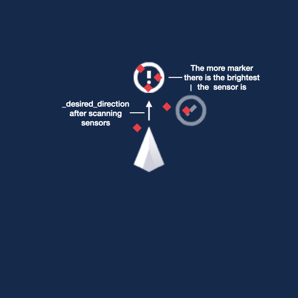
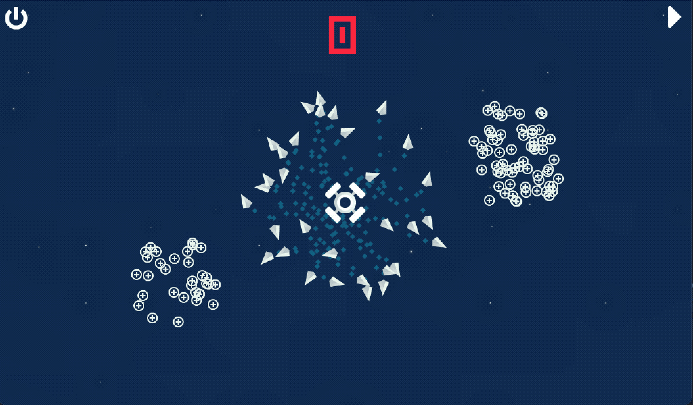
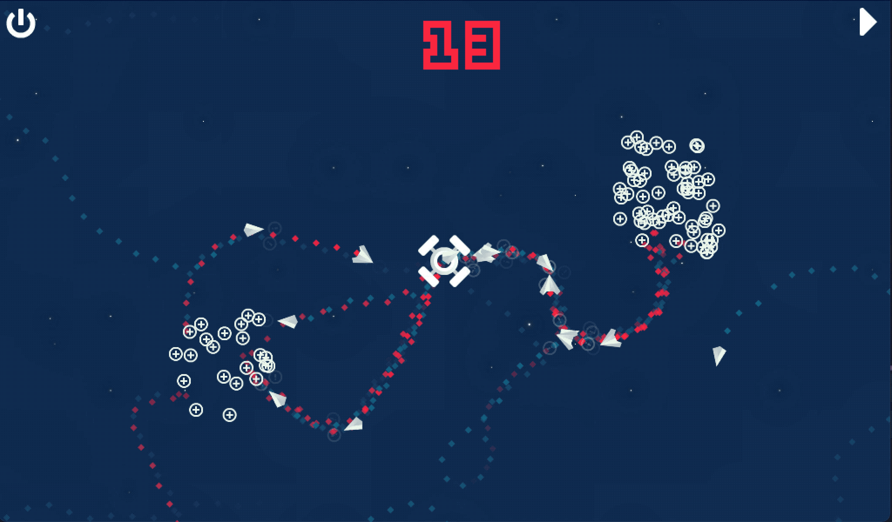

# IA-BDI, Multi Agent Spaceship


This is a 2D-simulation of multiple spaceships travelling through empty space to gather resources.

Spaceships are only aware of what is in front of them and can release markers that diffuse in space.

Resources are gather by lot in space.

## How to run the simulation

Go to [itch - Spaceship Simulation](https://adrkacz.itch.io/spaceship-simulation), and click **Run project**.

*You can write any suggestion you have below the project.*

## I want to edit and run the project

1. Go to [Godot](https://godotengine.org/download) official website and download the engine you need.

2. Clone this Git Repository
```
git clone https://github.com/AdrKacz/IA-BDI.git
```

3. Open **Godot**, and *scan* the folder you've just imported. The project *Spaceship-Simulation* should appear. Double-click on it to open it. Once done, click on the *Play* icon at the top right of your screen to launch it.

4. To learn more about Godot, go to their superb [documentation](https://docs.godotengine.org/en/stable/).

# The problem

Our home is lost in space and needs to retrieve **resources** around to survive.

You can release **spaceships** to go look for near by resources.

However, spaceships don't have an efficient radar, and pilots only see what is **not too far and in front** of them.

To help them in their quest, pilots can release **markers** in space while flying. These markers evaporate and **lose visibility over time**.

Once they leaved their home, pilots have **no idea where they are**, and how to find back their home.

**Space is great and dark.**

*Good luck!*

# Spaceship strategy

Spaceship will wander until it finds a target. If it doesn't carry a resource it will look for a **resource** and if it carries a resource it will look for its **home**.

While leaving its home, spaceship will release *blue markers*, to indicate the way back home.

After having found a resource, spaceship will release *red markers*, to indicate where resources are.

*In code, "marker" is replaced with "pheromone". This is so because it mainly takes its influence from pheromone phenomenon in ants [1].*

Spaceship has six sensors in front of it to measure the concentration of markers. Three *blue sensors* are for *blue markers* and three *red sensors* are for *red markers*.

The *blue sensors* and *red sensors* are laid out the same. One to the left at **-45°**, one just in front at **0°**, and one to the right at **+45°**.

Based on the value measured with its sensors, spaceship will change its `_desired_direction`.

`_desired_direction` is the direction spaceship try to move in. The direction is controlled by two hyper-parameters  `steer_strength`, and `max_speed`.

The more `steer_strength` is important the more the spaceship can accelerate to reach its `_desired_direction`.

`max_speed` is the velocity maximum of the spaceship.

```py
func _physics_process(delta : float) -> void:
  # ...
  # Assign _desired_direction
  # ...

  # Movement
  var desired_velocity : Vector2 = _desired_direction * max_speed
  var desired_streering_force : Vector2 = (desired_velocity - _velocity) * steer_strength
  var acceleration : Vector2 = desired_streering_force.clamped(steer_strength) / 1

  _velocity = (_velocity + acceleration * delta).clamped(max_speed)
  _velocity = move_and_slide(_velocity)

  # Rotation
  var angle : float = atan2(_velocity.y, _velocity.x)
  rotation = angle
```

## Releasing markers

Just after release, markers are fully visible. Then, they  lose intensity linearly over `evaporation_time` seconds.

```py
func get_strength() -> float:
  return max(0, 1 - lifetime / evaporation_time)
```

## Following markers

To measure sensor value, sensor adds up the strength of each markers in its zone.

```py
func update_value(look_for_resources) -> void:
  # Follow the way back (to move back and forth between source and home)
  _value = 0
    if look_for_resources:
      for area in $Resources.get_overlapping_areas():
        var pheromone := area as Pheromone
        _value += pheromone.get_strength()
    else:
    for are a in $Home.get_overlapping_areas():
      var pheromone := area as Pheromone
      _value += pheromone.get_strength()

  _value = min(saturation_value, _value)
  # Change alpha colour of sensor based on its _value
  # ...
```

This value cannot be greater than the `saturation_value` of the sensor.

This hyper-parameter avoid extreme concentration of agent in the same point.

Indeed, if without luck, numerous agents coming from opposites direction gather in the same point, they can start following each other in this exact same point, their sensor value sky rocket.

Thus they cannot escape this trap, cause the marker concentration became too important. Saturation let agent be distracted by other source even if stuck in a loop.



# Preview

Spaceships leave their home and quickly find the first lot of resources.



Spaceships create a stable route to go back and forth from home to resources.



# Infinite space issue

Space has no bound and spaceships quickly get lost and never found their home back.

To avoid this problem, we could simulate space boundary and add an edges detection system to spaceship. Another solution is to attract all spaceship to home if they are too far.

These two solutions are artificial and to not translate the real emptiness of space.

A more realistic solution is to ask each spaceship to store its `_desired_direction`'s over time. Thus it can estimate its distance from home, and then revert its `_desired_direction`'s when it's too far.
